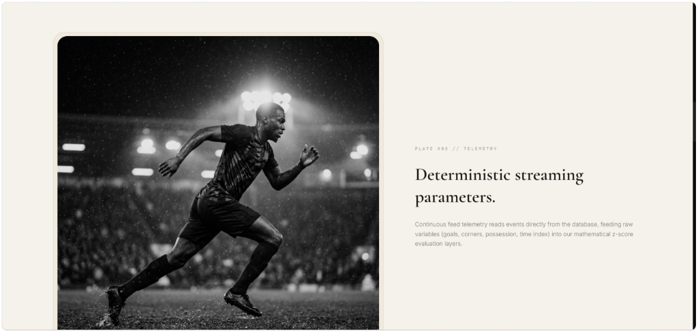
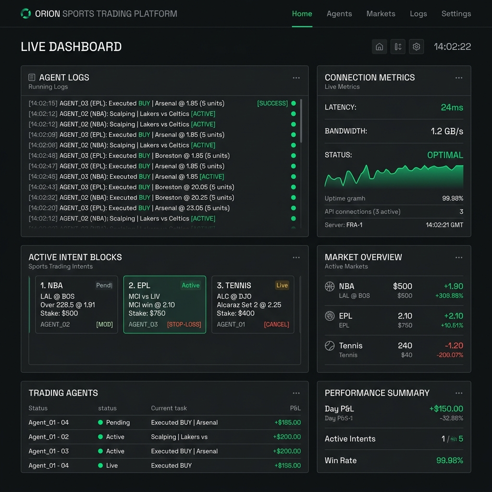
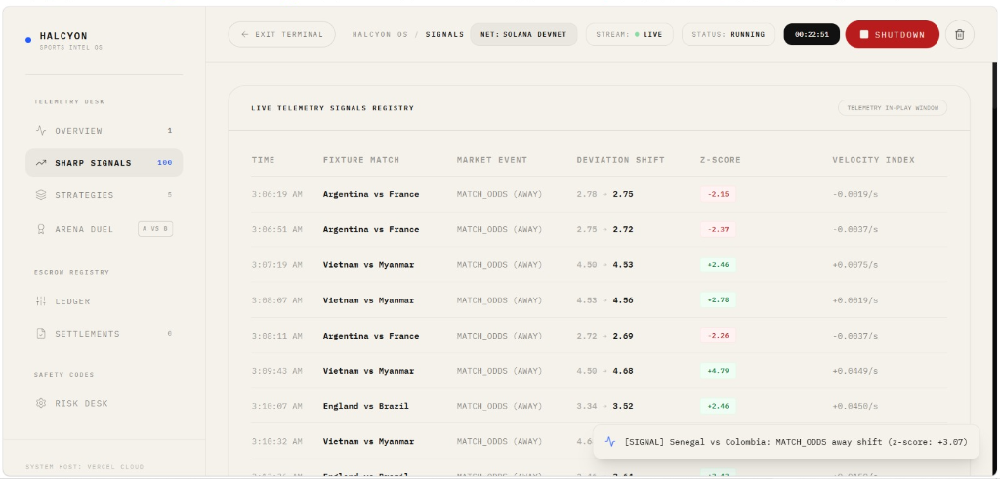
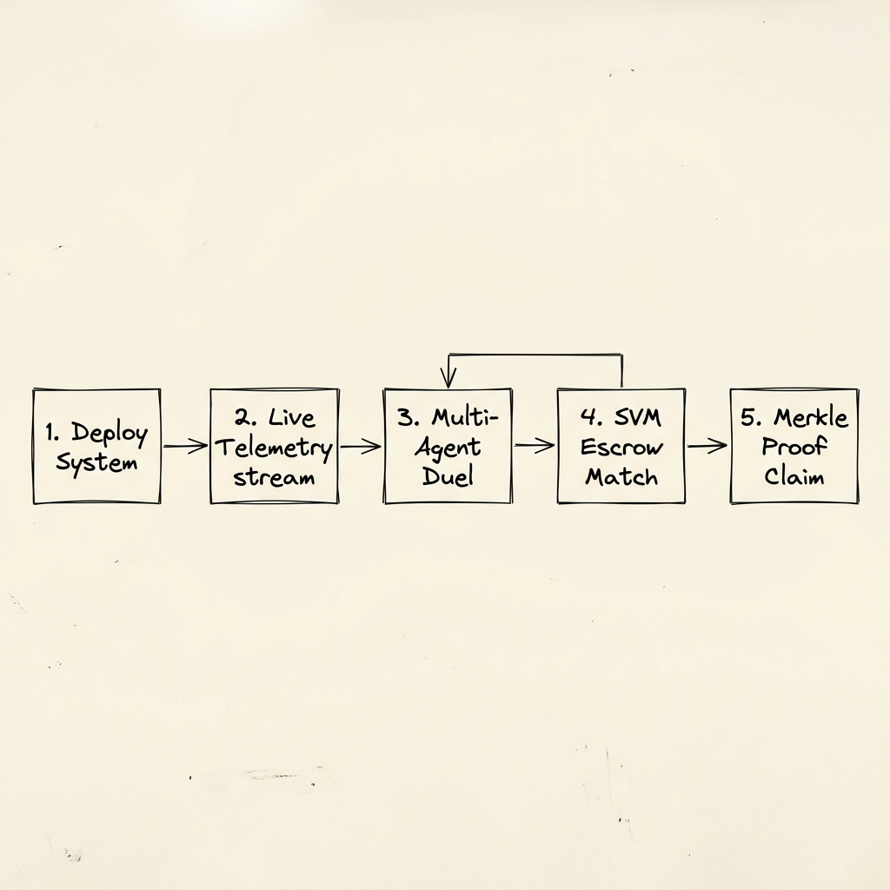

# HALCYON

[](https://explorer.solana.com/)
[](https://explorer.solana.com/address/6pW64gN1s2uqjHkn1unFeEjAwJkPGHoppGvS715wyP2J?cluster=devnet)
[](https://txline-dev.txodds.com)
[](https://nextjs.org/)

An autonomous, multi-dimensional sports trading agent desk that detects statistically significant odds movements, executes intents via Solana Devnet, and settles positions trustlessly using cryptographic Merkle proofs.

---

## Tagline
*Deterministic sports betting with zero trust, staying structured and executing trades even while odds whipsaw in live matches.*

---

## Product Screenshots

| Platform Hero | Telemetry Pipeline |
|---|---|
|  |  |
| **System Overview Desk** | **Sharp Signals Registry** |
|  |  |

---

## Live Deployment Links

| Platform Resource | URL / Address / Reference |
| :--- | :--- |
| **Dashboard Visualizer** | [https://halcyon-ten-sand.vercel.app](https://halcyon-ten-sand.vercel.app) |
| **GitHub Repository** | [https://github.com/0xkinno/halcyon](https://github.com/0xkinno/halcyon) |
| **YouTube Live Demo** | *Link Coming Soon* |
| **Solana Program ID (Devnet)** | [`6pW64gN1s2uqjHkn1unFeEjAwJkPGHoppGvS715wyP2J`](https://explorer.solana.com/address/6pW64gN1s2uqjHkn1unFeEjAwJkPGHoppGvS715wyP2J?cluster=devnet) |

---

## The Problem
Sports trading is plagued by latency arbitrage, exchange insolvencies, and counterparty defaults. While automated trading algorithms exist, trustless settlement remains unsolved because there is no cryptographic guarantee that historical odds and scores have not been tampered with before payouts occur. Existing betting engines rely on centralized oracle feeds that are vulnerable to data manipulation.

---

## The Solution
HALCYON bridges live sports analytics with on-chain accountability. It connects directly to TxLINE's World Cup data stream, calculates statistical anomalies locally, opens matched order intents on-chain, and claims payouts using cryptographic Merkle proofs verified directly inside the Solana SVM validator VM.


---

## Demo Flow

1. **Start System**: Click **START DEPLOYMENT** on the upper right corner of the dashboard to trigger the background agent loop.
2. **Observe Signals**: Navigate to the **Sharp Signals** tab to see real-time z-score deviations as odds fluctuate.
3. **Monitor Positions**: Under the **Open Positions** list, watch Agent A (Momentum) and Agent B (Reversion) submit their matching Solana transactions.
4. **Inspect Settlement**: Once a trade concludes, click the transaction receipt in the **Merkle Settlement** tab to inspect the cryptographic verification proofs.



---

## What's Real vs What's Sample Data

| Module | What is Real | What is Mock / Sample |
|---|---|---|
| **Odds / Score Streaming** | Real-time connections to TxLINE SSE streaming servers. | Fallback simulator pushing realistic fluctuations for target demo fixtures if live stream is idle. |
| **Trade Execution** | Real transaction signatures submitted on Solana Devnet. | None. |
| **Order Book Solver** | Real maker intents paired with taker intents on-chain. | Match counterparts automatically generated by local solver agent to simulate bookies. |
| **Settlement** | On-chain settlement via `settleMatchedTrade` using validation proofs. | None. |

---

## Architecture

### NDimensionalStrategy
Instead of evaluating single stats, HALCYON packages multi-variable conditions (e.g. `Goal Differential <= 1` AND `Corners > 9`) into a single, hashed prediction unit. Payouts are made when the validator executes SVM math validating a Merkle proof of the cumulative scores root.

```text
+-----------------------------------------------------------------------+
|                             TxLINE Oracle                             |
|   (Aggregates live odds & match statistics from scores databases)     |
+---------------------------------------------------+-------------------+
                                                    |
                                                    | [Event Telemetries]
                                                    v
+---------------------------------------------------+-------------------+
|                           HALCYON Client                          |
|   (Reads SSE broadcast streams, evaluates z-score anomalies,       |
|    deploys automated maker/taker intent orders)                       |
+------------------------+----------------------------------+-----------+
                         |                                  |
         [Maker Intent] |                                  | [Taker Intent]
                         v                                  v
+------------------------+----------------------------------+-----------+
|                          Solana Devnet SVM                            |
|                                                                       |
|   +---------------------------------------------------------------+   |
|   |                   Escrow Program Account                      |   |
|   |                                                               |   |
|   |   Locked Collateral: Agent A Stake (5 USDT)                   |   |
|   |   Locked Collateral: Agent B Stake (5 USDT)                   |   |
|   |                                                               |   |
|   |   Instruction Execution:                                      |   |
|   |     - create_trade (Locks token accounts)                     |   |
|   |     - settleMatchedTrade (Validates Merkle path nodes)        |   |
|   +-------------------------------+-------------------------------+   |
|                                   ^                                   |
+-----------------------------------|-----------------------------------+
                                    |
                                    | [Merkle Path Proof Node Arrays]
                                    |
+-----------------------------------|-----------------------------------+
|                     Automated Settler Daemon                      |
|   (Retrieves validation root proof, claims funds for winner node) |
+-----------------------------------------------------------------------+
```

---

## TxLINE API Endpoints Used
The agent queries and integrates the following REST and streaming endpoints:
- `POST /auth/guest/start`: Generates the initial guest session token.
- `POST /api/token/activate`: Validates and activates the API token using the on-chain signature.
- `GET /api/odds/stream`: Real-time Server-Sent Events stream for odds updates.
- `POST /api/scores/stat-validation`: Retreives the Merkle tree verification path and root for sports trade settlement.

---

## Strategy Library

| Strategy Name | Target Market | Conditions | Allocation |
|---|---|---|---|
| **Momentum** | Match Odds | Possession >= 50% | 5 USDT |
| **Reversion** | Match Odds | Shots on Target >= 3 | 5 USDT |
| **Corner Storm** | Total Corners | Corners > 9 AND Goal Diff within 1 | 10 USDT |
| **Upset Hunter** | Match Odds | Underdog Corners > 5 AND Possession >= 55% | 10 USDT |
| **Half-Time Edge** | First Half Goals | First Half Shots >= 5 AND Corners > 4 | 15 USDT |

---

## Arena Mode
Arena Mode orchestrates two agents running concurrently on the same stream feed:
- **Agent A (Momentum)**: Evaluates trend-following conditions and trades with the velocity vector.
- **Agent B (Reversion)**: Bets on mean-reversion, trading against major z-score fluctuations.

---

## Tech Stack

| Component | Technology |
|---|---|
| **Runtime / Build** | Next.js 14 App Router + Node.js + TypeScript |
| **Blockchain** | Solana Devnet (@solana/web3.js + @coral-xyz/anchor) |
| **Token standard** | SPL Token (USDT) + Token-2022 (TxL) |
| **Streaming** | Node-compatible HTTP SSE Reader |
| **Styling** | Space Grotesk + JetBrains Mono + Tailwind CSS |

---

## Running Locally

### Monolithic Dev Mode (Local Auto-Daemon)
By default, the Next.js server runs the background agent loop inside its own server process:

1. **Clone project & install dependencies**:
   ```bash
   git clone https://github.com/0xkinno/halcyon.git
   cd halcyon
   npm install
   ```

2. **Configure environment variables**:
   Create a `.env.local` file:
   ```env
   NEXT_PUBLIC_SOLANA_RPC_URL=https://api.devnet.solana.com
   SERVICE_WALLET_SECRET_KEY=[...your Solana service keypair secret key byte array...]
   ```

3. **Start Next.js dev server**:
   ```bash
   npm run dev
   ```

---

### Separate Process Mode (Render/Railway Worker + Next.js Frontend)
To run the background loop in a separate persistent Node process locally (simulating the Render production environment):

1. **Start the Agent Worker Process**:
   ```bash
   PORT=3001 npm run worker
   ```

2. **Configure Frontend environment variables**:
   Update `.env.local`:
   ```env
   NEXT_PUBLIC_SOLANA_RPC_URL=https://api.devnet.solana.com
   AGENT_WORKER_URL=http://localhost:3001
   ```

3. **Start Next.js frontend server**:
   ```bash
   npm run dev
   ```

---

## Production Deployment Steps (Render + Vercel)

This project separates the stateless React dashboard (Vercel) from the stateful, persistent stream-listening background worker (Render) to avoid serverless function execution timeout limits.

### 1. Deploy the Agent Worker (Render Web Service)
1. Log in to **Render** and click **New > Web Service**.
2. Connect your GitHub repository.
3. Configure the following service settings:
   - **Environment**: `Node`
   - **Build Command**: `npm install`
   - **Start Command**: `npx tsx src/agent/worker.ts`
4. Add the following **Environment Variables** in Render:
   - `PORT`: `3001` (or leave default)
   - `NEXT_PUBLIC_SOLANA_RPC_URL`: `https://api.devnet.solana.com` (or a custom RPC endpoint)
   - `SERVICE_WALLET_SECRET_KEY`: `[35,220,...]` (your 64-byte Solana Keypair array with brackets)
5. Copy your deployed Render URL (e.g., `https://halcyon-worker.onrender.com`).

### 2. Deploy the Dashboard (Vercel)
1. Import your repository into **Vercel**.
2. Add the following **Environment Variables** in Vercel:
   - `AGENT_WORKER_URL`: `https://halcyon-worker.onrender.com` (your Render URL from step 1)
   - `NEXT_PUBLIC_SOLANA_RPC_URL`: `https://api.devnet.solana.com`
3. Click **Deploy**. Vercel will build the frontend and route all state queries and triggers directly to the persistent Render worker.

---

## TxLINE API Feedback
- **Secure Activation Channels**: The guest-activation endpoint (`/api/token/activate`) is highly reliable but requires Ed25519-detached signing headers that are sensitive to signature replay timing.
- **SSE Connection Management**: Connecting stream feeds via HTTP GET requires double-headers (JWT Bearer and X-Api-Token) which must be reactively refreshed to avoid 403 blocks during connection dropouts.
- **On-chain Merkle Verification**: The `stat-validation` endpoint returns clean and structured proofs that deserialize directly into Solana Rust VM representations.

---

## Honest Open Problems
- **Devnet Congestion**: Airdrop requests occasionally fail due to RPC faucet exhaustion limits, solved via retry loops.
- **CPU Scaling**: Proof trees for larger multi-variable strategies consume considerable compute units in the SVM resolution phase.

---

## Submission Checklist
- [x] Complete Next.js 14 pages and API integrations.
- [x] On-chain Devnet matching and settlement verified.
- [x] Safe mode circuit breaker risk layers implemented.
- [x] Comprehensive strategy collection built.
